# 🎯 Sanca - Web3 ROSCA Platform

> **Transparent, Trustless Rotating Savings and Credit Association on Mantle Network**

[](https://opensource.org/licenses/MIT)
[](https://soliditylang.org/)
[](https://nextjs.org/)

## 📖 Overview

**Sanca** is a decentralized platform that brings traditional ROSCA (Rotating Savings and Credit Association) to Web3, enabling communities to save together, earn yield, and access credit in a transparent, trustless manner. Built on Mantle Network with integration to Ondo Finance for institutional-grade yield generation.

### What is ROSCA?

ROSCA (Rotating Savings and Credit Association) is a traditional community savings model where:
- Members contribute regular amounts to a shared pool
- Each member takes turns receiving the entire pool
- The cycle continues until all members have received their payout
- It's a proven system for financial inclusion and community wealth building

## 🎯 Problem Statement

Traditional ROSCAs face significant challenges:

- ❌ **Lack of Transparency** - No public record of transactions
- ❌ **Manual Management** - Requires trusted coordinators
- ❌ **Trust Required** - Members must trust each other and coordinators
- ❌ **No Yield Generation** - Funds sit idle without earning interest
- ❌ **Risk of Default** - No automated enforcement mechanisms

## 💡 Our Solution

Sanca solves these problems by leveraging blockchain technology:

- ✅ **Blockchain Transparency** - All transactions recorded on-chain, publicly verifiable
- ✅ **Smart Contract Automation** - Automated execution, no manual intervention needed
- ✅ **Trustless Execution** - Code enforces rules, no need to trust individuals
- ✅ **Yield via Ondo Finance** - Funds earn institutional-grade yield automatically
- ✅ **Collateral Protection** - Auto-liquidation if members fail to contribute

## 🚀 Key Features

### 1. Transparent Pools
All pool activities, contributions, and payouts are recorded on-chain. Members can verify every transaction at any time.

### 2. Automated Cycles
Smart contracts handle the entire pool lifecycle automatically - from member joining to payout distribution. No manual coordination needed.

### 3. Fair Randomness
Winner selection uses Supra VRF (Verifiable Random Function) for provably fair, on-chain randomness.

### 4. Yield Generation
Member collateral is automatically converted to Ondo mUSD (rebasing token) to earn yield. Winners receive a portion of the yield as a bonus.

### 5. Collateral Protection
If a member fails to contribute, their collateral is automatically liquidated to cover the contribution, protecting other members.

## 🏗️ Architecture

### System Architecture


### Value Proposition

```mermaid
graph LR
    subgraph "🎯 Problem Statement"
        P1["`**Traditional ROSCA Issues**
        - Lack of Transparency
        - Manual Management
        - Trust Required
        - No Yield Generation`"]
    end
    
    subgraph "💡 Sanca Solution"
        S1["`**Web3 ROSCA Platform**
        - Blockchain Transparency
        - Smart Contract Automation
        - Trustless Execution
        - Yield via Ondo Finance`"]
    end
    
    subgraph "🏗️ Architecture Overview"
        direction TB
        
        subgraph "Frontend"
            FE["`**Modern Web App**
            Next.js + React
            TypeScript`"]
        end
        
        subgraph "Blockchain"
            BC["`**Mantle Network**
            Smart Contracts
            EIP-1167 Factory`"]
        end
        
        subgraph "Indexing"
            IDX["`**Ponder.sh**
            Real-time Indexing
            GraphQL API`"]
        end
        
        subgraph "DeFi"
            DEFI["`**Ondo Finance**
            mUSD Yield Token
            Institutional Yield`"]
        end
    end
    
    subgraph "🚀 Key Features"
        direction TB
        F1["`**1. Transparent Pools**
        All transactions on-chain
        Public & Verifiable`"]
        
        F2["`**2. Automated Cycles**
        Smart contract execution
        No manual intervention`"]
        
        F3["`**3. Fair Randomness**
        Supra VRF
        Verifiable Random`"]
        
        F4["`**4. Yield Generation**
        Ondo mUSD rebasing
        Automatic accrual`"]
        
        F5["`**5. Collateral Protection**
        Auto-liquidation
        Risk mitigation`"]
    end
    
    subgraph "📈 Value Proposition"
        direction TB
        V1["`**For Users**
        - Earn yield on savings
        - Transparent & fair
        - No middleman fees
        - Community-driven`"]
        
        V2["`**For Mantle**
        - Showcases DeFi integration
        - Ondo Finance partnership
        - Real-world use case
        - Scalable architecture`"]
    end
    
    P1 -->|"Solves"| S1
    S1 --> FE
    S1 --> BC
    S1 --> IDX
    S1 --> DEFI
    
    FE --> F1
    BC --> F2
    BC --> F3
    DEFI --> F4
    BC --> F5
    
    F1 --> V1
    F2 --> V1
    F3 --> V1
    F4 --> V1
    F5 --> V1
    
    F1 --> V2
    F2 --> V2
    F3 --> V2
    F4 --> V2
    F5 --> V2
    
    style P1 fill:#ffcdd2,stroke:#c62828,stroke-width:2px
    style S1 fill:#c8e6c9,stroke:#388e3c,stroke-width:3px
    style FE fill:#e3f2fd,stroke:#1976d2,stroke-width:2px
    style BC fill:#c8e6c9,stroke:#388e3c,stroke-width:2px
    style IDX fill:#fff3e0,stroke:#f57c00,stroke-width:2px
    style DEFI fill:#ffecb3,stroke:#ffa000,stroke-width:2px
    style V1 fill:#e1bee7,stroke:#7b1fa2,stroke-width:2px
    style V2 fill:#b2ebf2,stroke:#0097a7,stroke-width:2px
```



## 🛠️ Tech Stack

### Frontend
- **Framework**: Next.js 16 with App Router
- **UI Library**: React 19
- **Language**: TypeScript
- **Styling**: Tailwind CSS v4
- **Components**: Radix UI + shadcn-style
- **Wallet**: RainbowKit + wagmi + viem

### Blockchain
- **Network**: Mantle Network (Sepolia Testnet / Mainnet)
- **Language**: Solidity 0.8.24
- **Framework**: Foundry (Forge, Cast, Anvil)
- **Pattern**: EIP-1167 Minimal Proxy (gas-efficient pool creation)
- **Libraries**: OpenZeppelin Contracts

### Indexing
- **Platform**: Ponder.sh
- **Database**: PostgreSQL
- **API**: GraphQL

### External Integrations
- **VRF**: Supra VRF V3 (on-chain randomness)
- **Yield**: Ondo Finance (USDY/mUSD rebasing tokens)
- **DEX**: Agni Router (USDC ↔ USDY swaps, mainnet)

## 📦 Installation

### Prerequisites

- Node.js 18+ and npm/pnpm
- Foundry (for smart contracts)
- PostgreSQL (for Ponder indexer)

### Setup

1. **Clone the repository**
```bash
git clone <repository-url>
cd sanca
```

2. **Install dependencies**
```bash
# Frontend
npm install
# or
pnpm install

# Contracts
cd contracts
forge install
```

3. **Configure environment variables**

Create `.env` files:

**Frontend** (`.env`):
```bash
NEXT_PUBLIC_WALLETCONNECT_PROJECT_ID=your_project_id
NEXT_PUBLIC_PONDER_URL=http://localhost:42069
NEXT_PUBLIC_FACTORY_ADDRESS=0x...
NEXT_PUBLIC_USDC_ADDRESS=0x...
NEXT_PUBLIC_MUSD_ADDRESS=0x...
```

**Contracts** (`.env`):
```bash
PRIVATE_KEY=your_private_key
MANTLE_SEPOLIA_URL=https://mantle-sepolia.g.alchemy.com/v2/API_KEY
ETHERSCAN_API_KEY=your_api_key
```

4. **Start Ponder indexer**
```bash
cd ponder
npm install
npm run dev
```

5. **Start frontend**
```bash
npm run dev
```

## 🚀 Usage

### Creating a Pool

1. Connect your wallet
2. Click "Create Circle"
3. Fill in pool details:
   - Pool name and description
   - Number of members (minimum 2)
   - Contribution amount per cycle
   - Duration per cycle (in days)
   - Yield bonus split percentage
4. Approve USDC and submit transaction

### Joining a Pool

1. Browse available pools
2. Select a pool to join
3. Approve USDC for collateral (contribution × maxMembers)
4. Join the pool

### Contributing to a Cycle

1. Navigate to your pool
2. Click "Contribute" when cycle is active
3. Approve USDC for contribution amount
4. Submit contribution

### Triggering a Draw

1. Wait for all members to contribute
2. Wait for cycle duration to pass
3. Click "Trigger Draw"
4. Winner is selected via Supra VRF
5. Winner receives payout + yield bonus

## 🔐 Security

- **Reentrancy Protection**: All external calls protected with `ReentrancyGuard`
- **Access Control**: Only whitelisted EOA can fulfill VRF requests
- **Input Validation**: All user inputs validated in smart contracts
- **Collateral Liquidation**: Automatic if member fails to contribute
- **Yield Calculation**: Based on actual mUSD balance vs deposited amount

## 📊 Token Flow

### Testnet (Current)
```
USDC → MockmUSD (1:1, no rebasing)
```

### Mainnet (Planned)
```
USDC → Agni DEX → USDY → Ondo mUSD (rebasing)
```

Ondo mUSD is a rebasing token that:
- Backed by USDY (Ondo Finance)
- Accrues yield automatically via rebasing mechanism
- Share-based system (similar to rUSDY)

## 🧪 Testing

### Smart Contracts
```bash
cd contracts
forge test
forge test -vvv  # Verbose output
```

### Frontend
```bash
npm run test
```

## 📝 Deployment

See [contracts/README.md](./contracts/README.md) for detailed deployment instructions.

Quick deploy to Mantle Sepolia:
```bash
cd contracts
forge script script/Deploy.s.sol:Deploy \
  --rpc-url mantle-sepolia \
  --broadcast \
  --verify
```

## 🗺️ Roadmap

### Phase 1: MVP (Current) ✅
- [x] Smart contract development
- [x] Frontend implementation
- [x] Ponder indexing
- [x] Testnet deployment

### Phase 2: Mainnet Launch
- [ ] Ondo Finance integration
- [ ] Agni DEX integration
- [ ] Mainnet deployment
- [ ] Security audit

### Phase 3: Enhancements
- [ ] Mobile app
- [ ] Multi-chain support
- [ ] Advanced analytics
- [ ] Governance features

## 🤝 Contributing

Contributions are welcome! Please feel free to submit a Pull Request.

## 📄 License

This project is licensed under the MIT License - see the [LICENSE](LICENSE) file for details.

## 🔗 Links

- **Live Demo**: [Coming Soon]
- **Documentation**: [docs/README.md](./docs/README.md)
- **Smart Contracts**: [contracts/README.md](./contracts/README.md)
- **Mantle Network**: https://www.mantle.xyz/
- **Ondo Finance**: https://ondo.finance/

## 👥 Team
| Member | Role | Contact |
| --- | --- | --- |
| Garry | Fullstack | [Github](https://github.com/garrybad) |

Built for Mantle Hackathon

---

**Made with ❤️ for the Mantle ecosystem**

